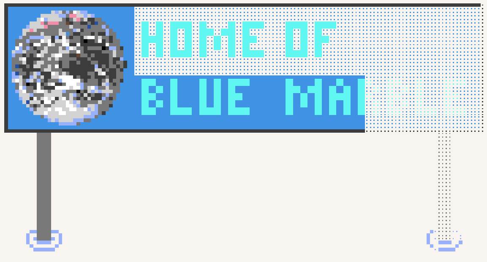

## 目录

* [Blue Marble](#blue-marble)

  * [概述](#概述)

    * [安装说明](#安装说明)
    * [模板说明](#模板说明)
    * [脚本设置](#脚本设置)
    * [模板设置](#模板设置)
  * [版本管理方式](#版本管理方式)
  * [许可证](#许可证)
  * [常见问题](#常见问题)

    * [Blue Marble 是恶意软件吗？](#blue-marble-是恶意软件吗)
    * [Blue Marble 如何帮我放置像素？](#blue-marble-如何帮我放置像素)
    * [如何隐藏叠加层？](#如何隐藏叠加层)
    * [为什么游戏通知会显示在叠加层上方？](#为什么游戏通知会显示在叠加层上方)

---

# Blue Marble

---

## 概述

欢迎使用 Blue Marble！
Blue Marble 是一个适用于 [wplace.live](https://wplace.live/) 的用户脚本，用于将图片叠加到画布上，让你可以轻松描绘图案，而不用频繁切换标签页或显示器。本仓库是[https://github.com/SwingTheVine/Wplace-BlueMarble](https://github.com/SwingTheVine/Wplace-BlueMarble)的汉化版本。

它支持：

* 显示升级所需像素数
* 简单坐标系（瓦片坐标和像素坐标）
* 将调色板移到屏幕顶部
* 对模板图片使用吸管取色
* 以及更多功能...

如果喜欢本项目，请为仓库加星 ⭐！

---

### 安装说明

支持浏览器：Chrome、Firefox\*、Safari、Edge、Brave
不支持：部分 Firefox 分支、Kiwi、Vivaldi

可在移动设备运行。

<b>安装 Chrome 版</b>

1. 安装 [TamperMonkey](https://chromewebstore.google.com/detail/tampermonkey/dhdgffkkebhmkfjojejmpbldmpobfkfo) 插件。  
2. 启用开发者模式 → 允许用户脚本。  
3. 点击 [一键安装](https://github.com/INP146/Wplace-BlueMarble/releases/download/vVersion/BlueMarble.user.js)。  
4. 刷新 [wplace.live](https://wplace.live/)。

<b>安装 Edge 版</b>

步骤类似 Chrome，但需手动下载 `.user.js` 文件并拖入 TamperMonkey 仪表盘安装。

<b>安装 Firefox 版</b>

1. 安装 [TamperMonkey](https://addons.mozilla.org/en-US/firefox/addon/tampermonkey/)。  
2. 点击 [一键安装](https://github.com/INP146/Wplace-BlueMarble/releases/download/vVersion/BlueMarble.user.js)。  
3. 刷新 [wplace.live](https://wplace.live/)。

---

### 模板说明

1. 找到模板左上角像素的坐标（瓦片 X、瓦片 Y、像素 X、像素 Y）。
2. 上传 PNG 或 WEBP 图片。
3. 点击“启用”按钮。

---

### 脚本设置

可调整脚本行为。
（原文中 Stealth Mode 和 Possessed Mode 说明被注释掉，但保留了功能逻辑说明。）

---

### 模板设置

#### 透明像素

Blue Marble 使用特殊颜色 `#deface` 表示“透明色”。模板中真正透明的像素会被忽略。

#### 坐标

* **瓦片坐标**：wplace.live 使用瓦片系统，每个瓦片内有独立的像素坐标。
* **模板坐标**：模板从左上角对齐，可用“图钉”图标自动填充。

---

## 版本管理方式

采用 [语义化版本](https://semver.org/)（X.Y.Z）：

* **X**：重大版本（不兼容更新）
* **Y**：次要版本（新功能、修复）
* **Z**：补丁版本（测试版修复）

---

## 许可证

* 代码：Mozilla Public License 2.0 (MPL-2.0)
* “Blue Marble” 图片：NASA CC0 1.0 公共领域授权

---

## 常见问题

### Blue Marble 是恶意软件吗？

不是，源码在 `src/` 文件夹，可自行构建。

### Blue Marble 如何帮我放置像素？

它**不支持**全自动放置，需用户交互。

### 如何隐藏叠加层？

关闭用户脚本并刷新页面。

### 为什么游戏通知会显示在叠加层上方？

因为通知需要优先引起注意，覆盖叠加层。
